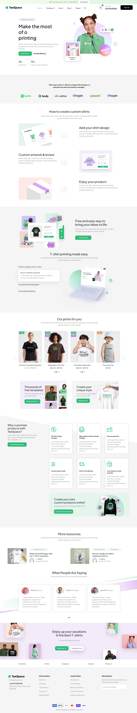
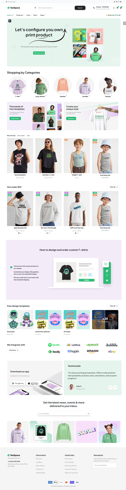

# T-Shirt Ecommerce Responsive Website Using Bootstrap 

## Table of contents

- [Overview](#overview)
  - [Screenshot](#screenshot)
  - [Links](#links)
- [Team Pages and Responsibilities](#Team-Pages-and-Responsibilities)
- [Technical Details](#Technical-Details)
- [Key Features](#Key-Features)
- [Conclusion](#Conclusion)

## Overview
This project comprises a responsive web application developed for a T-shirt landing page, utilizing the Bootstrap framework. The application's objective is to deliver a visually appealing and user-friendly experience to showcase and facilitate the sale of T-shirts. The design is based on an exploration of various T-shirt landing page templates found on Figma to ensure a modern and effective design. This project was developed as part of the ITI Intensive Code Camp Program.

**Figma Design Source Files**:https://www.figma.com/community/file/1338143066623036607 

  ### Screenshot
  
   
   
  
  ### Links
  
  - Github Repo URL: [Github Source Files](https://github.com/GhadaAhmed72/T-shirt-Landing-Page-using-Bootstrap)
  - Live Site URL: [Live Site URL]()
  
    
## Team Pages and Responsibilities

### Ghada Ahmed: [Team Member one]
- Home Page 1
- Shop Page 
- Service Details Page 
- Footer for all Pages 

### Abdelmonem Mahmoud Marei: [Team Member Two]
- Home page 2
- Blog Page
- Our Team Page
- Print Page

### Abdelrahman Mahmoud Arafa: [Team Member Three]
- Home Page 3
- Services Page
- Shop Details Page
- FAQ Page

### Alaa Elsayed: [Team Member Four]
- Home page 4
- Blog details page
- Pricing Page
- About Page

## Technical Details
  - **Frontend Framework**: Bootstrap
  - **Design Tool**: Figma
  - **Languages**: HTML, CSS, JavaScript
  - **Responsive Design**: Achieved using Bootstrap's grid system and css 3 flex and grid properities.

## Key Features
  - **Responsive Design**: The website adapts seamlessly to various screen sizes, including desktops, tablets, and smartphones.
  
  - **Visually Appealing Design**: Modern and attractive design, inspired by top T-shirt landing page templates.
  
  - **Product Showcase**: Effective display of T-shirts, incorporating high-quality images and detailed descriptions.
  
  - **Easy Navigation**: Intuitive navigation to enhance the user experience.
  
  - **Call to Action**: Clear and prominent call-to-action buttons to drive sales.
  
  - **Fast Loading**: Optimized for performance to ensure quick loading times.
## Conclusion
This T-shirt landing page project is a responsive web application that effectively showcases T-shirts in a visually appealing and user-friendly manner. Bootstrap was used to ensure responsiveness, and the design was inspired by a collection of Figma templates. The website is optimized for performance and ease of navigation. The project's development was supported by the ITI Intensive Code Camp scholarship program.
